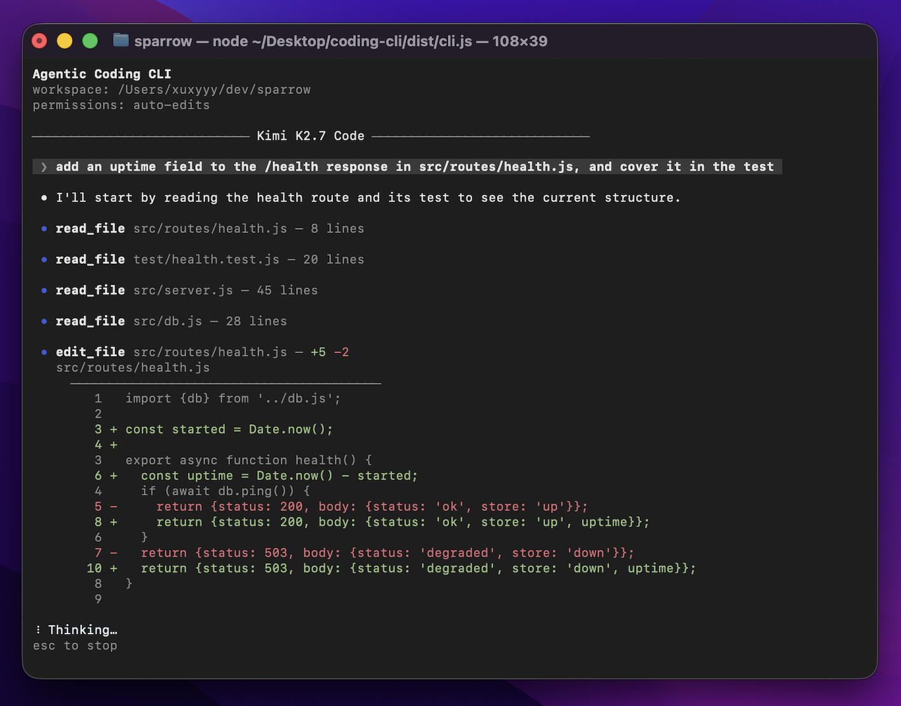

# acc

[](https://github.com/Xuxyyy/coding-cli/actions/workflows/test.yml)
[](LICENSE)

A small terminal coding agent that reads, edits, and runs code in the current
directory.

<p align="center">
  
</p>

## What it is

One TypeScript package — 6,582 lines and 692 tests. You start it inside a
project, describe a task in plain English, and it reads the files, searches
them, edits them, and runs commands until the task is done — asking you first
before anything it cannot take back.

- Five built-in tools: `read_file`, `grep`, `edit_file`, `write_file`, and
  `bash`.
- MCP servers, declared in `~/.acc/settings.json` and started with `acc`. Their
  tools are published beside the built-in five, and no permission mode runs one
  of them silently — [why](https://coding-cli-docs.vercel.app/design/mcp/).
- Three providers — DeepSeek, GLM, and Kimi — six models behind one client.
- One permission gate that every tool call passes through.
- Sessions you can reopen. `/resume` returns to an earlier run; `/rewind` takes
  the conversation *and* the files back to before a message you sent.
- A context readout. `/context` prints how full the window is, with a
  breakdown; `/compact` replaces the conversation with a summary when it gets
  long.

**It edits your files and runs shell commands** in the folder you start it
from. That is what it is for, and it is why every call goes through the gate.

## Quick start

```bash
git clone https://github.com/Xuxyyy/coding-cli.git
cd coding-cli
npm install   # prepare runs tsc, so there is no separate build step
npm link
cd ~/some-project
acc
```

It is not published on npm — cloning is the way to install it.

**The workspace is the current directory.** `acc` takes no path argument and no
flags, and it refuses to start in your home directory or at the filesystem
root, so `cd` into a project folder first.

## Requirements and keys

- Node 22 or newer, on macOS or Linux. The `bash` tool runs commands through
  `bash`, so Windows needs WSL.
- ripgrep (`rg`) on your `PATH`, for the `grep` tool. Without it the agent falls
  back to shell `grep` — that works, but it is slower and ignores `.gitignore`.
- One API key is enough. Copy `.env.example` to `.env` and fill in DeepSeek,
  GLM, or Kimi; `acc` picks a model from whichever key it finds. The six model
  ids are on [Settings and models](https://coding-cli-docs.vercel.app/reference/settings/).

## How it works

**The seam.** `src/core` runs the agent and never imports React; `src/ui` draws
it with Ink. They meet at one interface, `Host` in `src/core/host.ts`, which is
three members: `confirm`, `onEvent`, and `signal`. No import points the other
way, so the turn loop is tested without ever starting a terminal.

**One permission gate.** Every tool call passes through `permitted()` in
`src/core/tools/registry.ts`; there is no second route to the filesystem or the
shell. A session approval is remembered only when the decision comes back
`suppressible`, which is what stops a guardrail from being remembered by
mistake — a refusal you were meant to see cannot be turned off by an earlier
"yes".

**Resume in place.** Each run writes a `session.jsonl`, one record per line,
holding both the messages the model saw and the view the terminal drew. `/resume`
reopens a session in the folder it already owns instead of copying its history
into a new one, so a resumed run and its original stay a single session on disk.

The longer version of all three, with the alternatives that were rejected, is
[How it's built](https://coding-cli-docs.vercel.app/design/how-its-built/) on
the docs site.

## Design notes

Six design docs in [`docs/`](docs/) — about 2,300 lines — record *why* each
subsystem is shaped the way it is, one doc per subsystem. The code is the truth
about *what*; those files are the truth about *why*, and each one opens with
when to read it.

Left undone on purpose: a git-backed snapshot that would catch what `bash`
changes, and a byte cap on the copies a write stores — both wait for numbers
from real use rather than a guess. So does compacting and retrying when a
provider rejects a turn for length: the error differs per provider, and there is
no way to test it without paying for a deliberate failure.
[`docs/features.md`](docs/features.md) lists what ships today and what does not.

## Docs

Full documentation is at
[coding-cli-docs.vercel.app](https://coding-cli-docs.vercel.app).

- [Install and first run](https://coding-cli-docs.vercel.app/start/install/)
- [How it's built](https://coding-cli-docs.vercel.app/design/how-its-built/)
- [Commands](https://coding-cli-docs.vercel.app/reference/commands/)

## Contributing

See [CONTRIBUTING.md](CONTRIBUTING.md).

## License

MIT — see [LICENSE](LICENSE).
