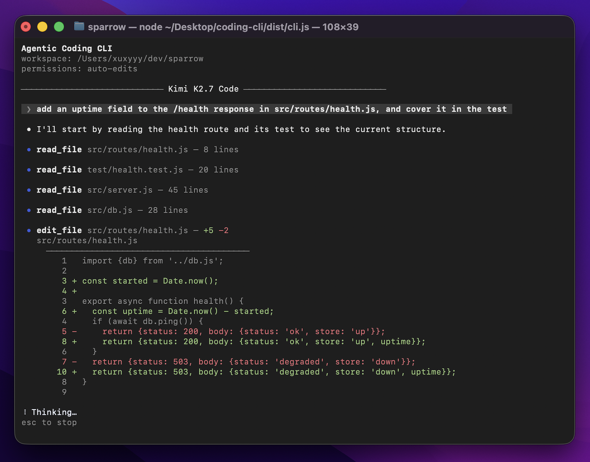

# acc

[](https://github.com/Xuxyyy/terminal-coding-agent/actions/workflows/test.yml)
[](LICENSE)

A small terminal coding agent that reads, edits, and runs code in the current
directory.

<p align="center">
  
</p>

## What it is

One TypeScript package with a local test suite. You start it inside a
project, describe a task in plain English, and it reads the files, searches
them, edits them, and runs commands until the task is done. The default permission
mode is `auto`: actions above its automatic allowance threshold go to a model
judge, then to you when approval is still needed. An explicitly saved mode wins.

- Default `auto` mode offers four tools: `bash`, `edit_file`, `write_file`,
  and `agent`. `ask-edits` and `auto-edits` also offer `read_file`, `grep`, and `glob`.
  Global [agent definitions](https://coding-cli-docs.vercel.app/configure/subagent/)
  can give a sub-agent its own prompt, model, tools, and stricter permission mode.
  The parent waits for its report; the child has a separate conversation and
  cannot spawn another agent.
- Gemini is the only model provider, using the native Interactions API.
  Gemini 3.8 Flash is the default. Gemini 3.1 Pro Preview and Gemini 3.5
  Flash-Lite are also selectable. Permission judging uses Flash-Lite regardless
  of the main agent's selected model.
- One permission gate for file and shell actions, including sub-agent actions.
- In `auto`, prefer Bash for reading, searching, and commands. Prefer Edit and
  Write for ordinary file changes so `/rewind` can use their existing backups
  when available. These are preferences, not restrictions.
- Sessions you can reopen. `/resume` returns to an earlier run; `/rewind` takes
  the conversation and files captured by file-tool backups back to before a
  message you sent. Shell changes are not captured or restored. Git cannot
  reliably recover overwritten uncommitted work.
- Context management. `/context` shows window usage. Before a model request,
  the agent automatically compacts at 80% projected usage. `/compact` can also
  run manually. Compaction keeps recent user prompts and summarizes older
  context; a failed summary preserves the conversation and stops the run.
- Bounded work. The agent reviews progress privately every 10 model turns.
  Interactive runs ask to continue after each 60-turn segment. Print mode
  stops at its configured turn or time limit.

**It edits your files and runs shell commands** in the folder you start it
from. That is what it is for, and it is why every call goes through the gate.

## Quick start

```bash
git clone https://github.com/Xuxyyy/terminal-coding-agent.git
cd terminal-coding-agent
npm install   # prepare runs tsc, so there is no separate build step
npm link
acc --version
cd ~/some-project
acc
```

It is not published on npm — cloning is the way to install it.

**The workspace is the current directory.** Interactive `acc` takes no path
argument, and it refuses to start in your home directory or at the filesystem
root, so `cd` into a project folder first. `acc --version` is
workspace-independent.

## Requirements and keys

- Node 22 or newer, on macOS or Linux. The `bash` tool runs commands through
  `bash`, so Windows needs WSL.
- ripgrep (`rg`) on your `PATH`, for fast shell searches and the `grep` and `glob` tools.
  If it is missing, the tools report an error and suggest shell `grep` or `find`.
  Shell searches do not inherit the tool's sensitive-file exclusions.
- Set `GEMINI_API_KEY` in your environment or copy `.env.example` to `.env`
  and fill it in. Keys load from the shell, then the project's `.env`, then
  `~/.acc/.env`. Model IDs and selection settings are on
  [Models](https://coding-cli-docs.vercel.app/configure/models/).

## Print mode

Run one task without an interactive terminal:

```bash
acc -p "summarize this project" --max-steps 60 --max-seconds 300
```

`--json` emits structured events and a final result. `--max-steps` limits model
turns, including the final answer; `--max-seconds` limits elapsed time. Their
defaults are 60 and 300. Confirmations are denied unless `--yes` is passed.
Actions already allowed by the permission gate can still run and edit files.
Print runs do not save resumable sessions. See [Print mode](docs/headless.md).

## Sandbox

Sandbox defaults to **Off**. On is supported only on macOS; Linux uses Off.
Use `/sandbox` while idle, or launch with `acc --sandbox on` (also supported
with `-p`). The choice lasts for this ACC process and stays visible in the UI.
Both modes keep permission checks and clean shell environments. Off removes
ACC's OS file and network restrictions; environment cleanup cannot stop
commands from reading credential files. See [sandbox details](docs/sandbox.md).

## How it works

**The seam.** `src/core` runs the agent and never imports React; `src/ui` draws
it with Ink. They meet at `Host` in `src/core/host.ts`: `confirm`, `onEvent`,
`signal`, and optional `onModelUsage` for token accounting. Core never imports
UI, so the turn loop is tested without starting a terminal.

**The loop.** The model receives the conversation and available tools. Its
requested tools run in order, their results enter the conversation, and the
next model request continues the task. A response without tool calls ends the
turn. Progress reviews, permission decisions, context checks, and cancellation
bound this loop.

**One permission gate.** File and shell actions pass through `permitted()` in
`src/core/tools/registry.ts`. The parent `agent` call delegates a job; each file
or shell action inside the child receives its own permission check. A session
approval is remembered only when the decision comes back
`suppressible`, which is what stops a guardrail from being remembered by
mistake — a refusal you were meant to see cannot be turned off by an earlier
"yes".

**Resume in place.** Each interactive session writes a `session.jsonl`, one
record per line, holding both the messages the model saw and the view the terminal drew. `/resume`
reopens a session in the folder it already owns instead of copying its history
into a new one, so a resumed run and its original stay a single session on disk.

The longer explanation is
[Architecture](https://coding-cli-docs.vercel.app/design/architecture/) on
the docs site. The design docs in [`docs/`](docs/) explain each subsystem and
its tradeoffs in more detail.

## Evaluation

`acc` keeps two active release gates: 60 permission-judge cases and six
black-box package/CLI scenarios. Safety and installed-product behavior are
reported separately. The Judge eval calls a live model and is an optional paid
check; normal tests and package/CLI checks run without paid model calls.

See [Evaluation](https://coding-cli-docs.vercel.app/design/evaluation/) for
commands and evidence limits.

## Not built yet

Left undone on purpose: a git-backed snapshot that would catch what `bash`
changes, a byte cap on file backups, and compacting and retrying after a
provider rejects a request for length. The current loop checks projected
context before sending a request.
[`docs/features.md`](docs/features.md) lists what ships today and what does not.

## Docs

Full documentation is at
[coding-cli-docs.vercel.app](https://coding-cli-docs.vercel.app).

- [Install](https://coding-cli-docs.vercel.app/start/install/)
- [Architecture](https://coding-cli-docs.vercel.app/design/architecture/)
- [Commands](https://coding-cli-docs.vercel.app/configure/commands/)

## Contributing

See [CONTRIBUTING.md](CONTRIBUTING.md).

## License

MIT — see [LICENSE](LICENSE).
